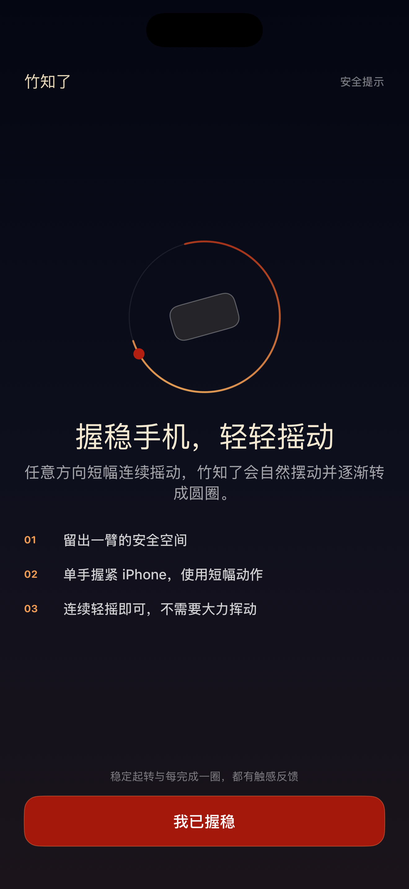
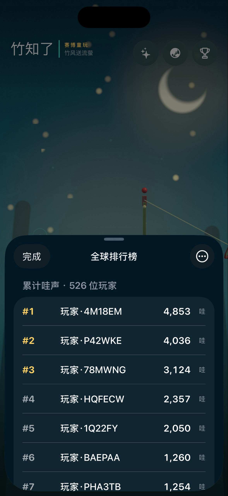
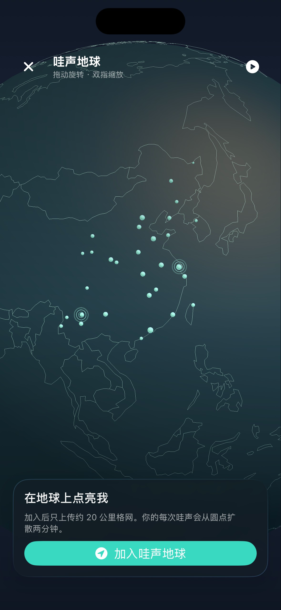

# 赛博竹知了

把传统民间童玩“竹知了”装进 iPhone 与 Android 手机。轻轻往复摇动手机或用手指在屏幕上画圈，竹知了会随动作旋转，并根据转速发出不同节奏和响度的叫声。

<p align="center">
  
  
  
</p>

<p align="center">
  
  
</p>

## 特性

- SwiftUI + Metal 的原生 iOS 客户端，以及 Kotlin + 传统 View + OpenGL ES 的原生 Android 客户端
- Core Motion / Android Sensors 三轴动作识别与固定步长绳系物理模拟
- 体感、全屏触控和自动演示三种玩法
- 根据转速动态调整速度、音高和音量的真实录音
- 春、夏、秋、冬四套季节画面
- 匿名汇总的实时在线连接数与“哇声”计数
- 匿名全球累计排行榜，展示前 100 名、玩家总数和自己的名次
- 可旋转、缩放和暂停自转的“哇声地球”，展示匿名粗略位置圆点与十分钟共鸣波纹和声音
- 基于镜头缩放的地理预聚合与屏幕空间圆点聚合
- 可随时退出哇声地球，或清除排行榜匿名身份与相关数据
- 无账号、无广告、无内购

## 技术栈

- iOS 客户端：Swift 6、SwiftUI、Metal / MetalKit、Core Motion、Core Location、AVFoundation、Keychain
- Android 客户端：Kotlin、传统 View、OpenGL ES 3.0、Android Sensors、SoundPool
- 服务端：Node.js、WebSocket、SQLite
- 平台：iPhone（iOS 17.0+）与 Android 手机（Android 10+），竖屏

## 从源码运行

### iOS 客户端

1. 使用 Xcode 26 或兼容版本打开 `ZhuZhiLiao.xcodeproj`。
2. 在 `ZhuZhiLiao` target 的 Signing & Capabilities 中选择你的开发团队；如果使用真机，同时换用可用的 Bundle Identifier 和描述文件。
3. 选择 iOS 17+ 的 iPhone 或模拟器，运行 `ZhuZhiLiao` scheme。

真机可使用完整的体感玩法。模拟器会自动演示，也可按住画面并拖动鼠标来控制。

工程已提交 Xcode 项目文件，无需额外生成。如需根据 `project.yml` 重新生成，请先安装 [XcodeGen](https://github.com/yonaskolb/XcodeGen)，然后运行：

```bash
xcodegen generate
```

### Android 客户端

使用 Android Studio 打开 `android/`，选择 Android 10（API 29）或更高版本的手机运行。命令行构建：

```bash
cd android
./gradlew assembleDebug
```

Debug APK 输出到 `android/app/build/outputs/apk/debug/app-debug.apk`。没有可用动作传感器时会自动演示，也可按住屏幕滑动控制；“哇声地球”仅在用户主动加入时申请粗略位置权限。

### 在线服务

本地运行需要 Node.js 20 或更高兼容版本：

```bash
cd server
npm ci
npm start
```

服务默认监听 `127.0.0.1:3210`，为全球计数、匿名排行榜和哇声地球提供：

- `GET /healthz` 和 `GET /api/stats`：健康检查与聚合统计
- `POST /api/players`、`GET /api/leaderboard`、`DELETE /api/players/me`：创建、查询和删除匿名玩家数据
- `PUT /api/players/me/earth` 和 `DELETE /api/players/me/earth`：加入、更新或退出哇声地球
- `WS /api/ws`：累计计分、实时统计、地球快照与更新通知

如需修改配置，可参考 `server/.env.example` 设置 `HOST`、`PORT`、`SQLITE_PATH` 和 `INITIAL_WAHS` 环境变量。客户端默认连接线上服务；要调试本地服务，请修改 `ZhuZhiLiao/Network/CounterService.swift` 或 `android/app/src/main/java/com/azhegezhege/zhuzhiliao/network/CounterService.kt` 中的 WebSocket 和 HTTP 端点常量。部署、认证和协议详情见 [`server/README.md`](server/README.md)。

## 测试

在 Xcode 中按 `⌘U`，或使用命令行运行 iOS 单元测试：

```bash
xcodebuild test \
  -project ZhuZhiLiao.xcodeproj \
  -scheme ZhuZhiLiao \
  -destination 'platform=iOS Simulator,name=iPhone 17 Pro,OS=latest'
```

服务端测试：

```bash
cd server
npm test
```

Android 单元测试：

```bash
cd android
./gradlew testDebugUnitTest
```

## 项目结构

```text
ZhuZhiLiao/App/        主界面、排行榜、季节主题与交互协调
ZhuZhiLiao/Earth/      哇声地球界面、位置量化、地理边界与数据模型
ZhuZhiLiao/Network/    匿名身份、排行榜、计分与地球协议
ZhuZhiLiao/Rendering/  竹知了和地球的 Metal 渲染
ZhuZhiLiaoTests/       物理、动作滤波、计圈与网络编解码测试
android/               Android 应用源码、资源与单元测试
server/                计数、排行榜与哇声地球服务
metadata/              App Store 元数据
screenshots/           App Store 截图与审核记录
submission/            隐私政策与提审材料
project.yml            XcodeGen 工程配置
```

## 隐私与安全

动作数据仅在本机用于控制玩具，不会上传。在线服务会为安装创建随机匿名玩家 ID 和六位公开短码，并使用保存在 iOS Keychain 或 Android Keystore 加密存储中的令牌同步累计成绩；它们不是设备硬件标识符，也不包含姓名或联系方式。

哇声地球无需位置权限即可浏览。只有用户主动加入时，应用才请求“使用 App 期间”定位；Android 仅申请粗略位置。两端都只上传在客户端量化后的约 20 公里格网编号，不上传原始精确坐标，不进行后台定位。用户可单独退出哇声地球，也可在排行榜中清除匿名身份、排名、地球位置和本机个人累计；已计入的全球聚合总数不会回退。详见 [`submission/privacy-policy-zh-Hans.md`](submission/privacy-policy-zh-Hans.md)。

体感游玩时请稳握手机，只做短幅、轻柔、连续的动作，并与他人和物品保持距离。
